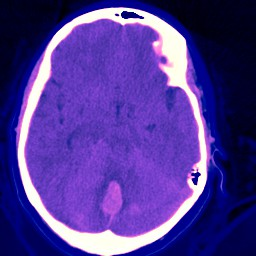

# Translational Bioinformatics @ Columbia University
## Fall 2019
## Final Project: Detecting Intracranial Hemorrhage with Deep Convolutional Neural Networks

### 


Team:
	+ Matteo Di Bernardo
	+ Tim R. Schleicher

+ **Project summary**: 

Traumatic brain injuries can result in internal bleeding within the brain, often classified by health professionals as intracranial hemorrhage (ICH), a process that can cause permanent brain damage and is responsible for almost 30% of yearly injury deaths in the United States. Other traumatic events or persistent conditions, such as strokes or high blood pressure, can also lead to ICH. In order to initiate ICH treatment, which often involves invasive surgery when cases are life threatening, experienced radiologists are required to quickly identify the presence of ICH and its subtype via computed tomography (CT) scans. This has becomean increasingly difficult endeavor in the face of limited availability of radiologists, efforts to reduce costs in the healthcare system, and most importantly, the little time available for a time-consuming analysis needed to save the life of the patient. 

The boom of machine learning techniques, speciffically image classiffier algorithms, present an unprecedented opportunity to support specialists in quick and life-saving decision-making as they seek to determine whether an ICH is occurring, and if so, where in the brain it is located. To address the potential for
algorithms of this nature to detect ICH, the Radiological Society of North America has published a dataset of over 25,000 labeled CT exams for a Kaggle challenge that aims to solicit teams to devise machine learning algorithms in order to detect ICH.

We developed and implemented several state-of-the-art Convolutional Neural Network (CNN) as an image classiffier for the identification of ICHs. The predictive power of our algorithms are evaluated and discussed. Our humble research seeks to facilitate better and faster diagnosis of ICH at lower costs and has the potential to contribute to changing the lives of patients with a complication where a few additional minutes could mean the difference between life and death.


Following [suggestions](http://nicercode.github.io/blog/2013-04-05-projects/) by [RICH FITZJOHN](http://nicercode.github.io/about/#Team) (@richfitz). This folder is orgarnized as follows.

```
proj/
├── tree_app/
├── data/
├── doc/
└── output/
```

Please see each subfolder for a README file.

